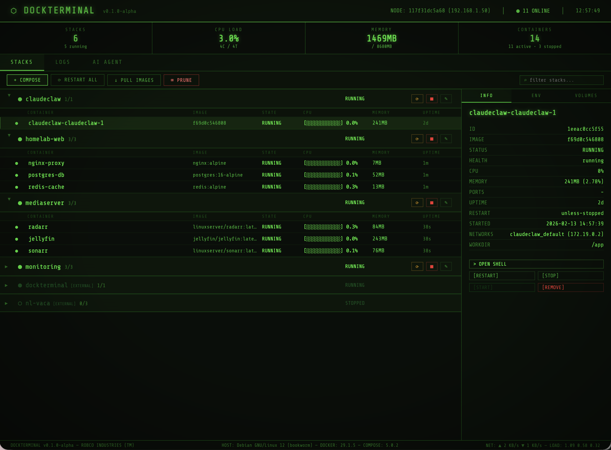

# DockTerminal

### Your Docker homelab deserves a cooler dashboard.

DockTerminal is a retro CRT-styled Docker management dashboard. Scanlines, phosphor glow, green-on-black — manage your containers like you're hacking into a mainframe from 1987.

No Electron. No Docker SDK. Just a React SPA that shells out to the Docker CLI.

<!-- Add a screenshot here:  -->

---

## Quick Start

```bash
docker compose up -d
```

Open [http://localhost:5001](http://localhost:5001). That's it.

> **Heads up:** DockTerminal has no built-in authentication. See [Security](#security) before exposing it beyond localhost.

---

## What You Get

### Stacks & Containers
Compose projects are detected automatically. Managed stacks (from your stacks directory) get full controls — up, down, restart, stop, edit compose files. Unmanaged projects show up read-only. Standalone containers get their own group.

### Live Stats
CPU, memory, network I/O, and container resource usage — polled every 3 seconds. No agents, no daemons, no overhead.

### Shell Terminal
`docker exec` straight from the browser. Real shell, real output, ANSI colors preserved. Type commands, see results.

### Compose Editor
Create and edit stacks with a split-pane YAML editor. Live service graph on the right shows your services, dependencies, and networks as you type. Ships with starter templates (Nginx + SSL, Postgres + Redis, Node.js).

### AI Diagnostics
Auto-scans for non-running containers and generates a diagnosis: exit codes, image state, multi-container impact, and a recommended fix. One-click execute (with confirmation) to restart or resolve.

### Streaming Operations
Compose up/down operations stream live output via SSE. Watch your stack come online in real time — colored output, status indicators, exit codes.

### Logs
Aggregated Docker events or per-container logs. Filter by level (INFO / WARN / ERR) and search by keyword. Color-coded, auto-scrolling.

### The Aesthetic
CRT scanlines, vignette overlay, glitching logo text, block-character progress bars, phosphor green on pitch black. Boot sequence on first load. Status bar with host OS, Docker version, and network throughput. It looks like a terminal from a game you love.

---

## Installation

### Docker (recommended)

The default `docker-compose.yml` binds to port **5001**, mounts the Docker socket, and uses `/opt/stacks` for managed stacks. The image includes a healthcheck on `/api/health`.

To customize, edit `docker-compose.yml`:

```yaml
services:
  dockterminal:
    image: dockterminal:latest
    build: .
    container_name: dockterminal
    restart: unless-stopped
    ports:
      - "5001:5001"              # change the left side to remap the host port
    volumes:
      - /var/run/docker.sock:/var/run/docker.sock
      - /path/to/your/stacks:/opt/stacks
    environment:
      - DOCKTERMINAL_STACKS_DIR=/opt/stacks
```

Then `docker compose up -d` and open [http://localhost:5001](http://localhost:5001).

### Native (Node.js)

Node 22+ and Docker required.

```bash
npm install
npm run build
DOCKTERMINAL_PORT=5001 npm start
```

Open `http://localhost:<DOCKTERMINAL_PORT>` (default **5001**).

### Development

```bash
npm install
npm run dev
```

Open [http://localhost:5173](http://localhost:5173). Vite dev server with HMR + API middleware.

To preview a production build locally: `npm run preview`.

---

## Configuration

| Variable | Default | Applies to | Description |
|---|---|---|---|
| `DOCKTERMINAL_STACKS_DIR` | `~/stacks` (native) / `/opt/stacks` (Docker) | Both | Directory to scan for managed stacks |
| `DOCKTERMINAL_PORT` | `5001` | Native only | Server port. In Docker, change the port mapping in `docker-compose.yml` instead |

A **managed stack** is any subdirectory in your stacks dir containing a compose file (`compose.yaml`, `compose.yml`, or `docker-compose.yml`). Managed stacks get action buttons and appear even when stopped.

Compose projects detected via `docker compose ls` that live outside your stacks dir show up as read-only. Containers not in any compose project are grouped under "standalone".

---

## Security

DockTerminal has **no built-in authentication or authorization**. Anyone who can reach the port can view, stop, restart, and remove your containers — and open a shell into any running container.

It also mounts the Docker socket, which is effectively **root access to the host**.

**You are responsible for securing access.** At minimum:

- **Don't expose DockTerminal to the internet** without a reverse proxy and authentication in front of it (e.g. Nginx/Caddy + basic auth, Authelia, Authentik, or a VPN like Tailscale/WireGuard).
- **Bind to localhost only** if you're accessing it from the same machine — change the port mapping to `127.0.0.1:5001:5001` in `docker-compose.yml`.
- **Restrict network access** if running on a LAN — use firewall rules to limit which IPs can reach the port.

The shell terminal blocks a set of known dangerous commands (`rm -rf /`, `shutdown`, `reboot`, `mkfs`, `dd if=`, fork bombs, writes to `/dev/sd*`, `chmod -R 777 /`, `mv /`), but this is a safety net — not a security boundary.

---

## Tech

- React 19, Vite, Express
- Zero UI libraries — every component is hand-built
- Zero Docker SDK — talks to Docker via `execFileSync` on the CLI
- CSS Modules + CRT overlay effects
- ~250 KB production bundle (gzipped: ~80 KB)

---

## License

MIT
